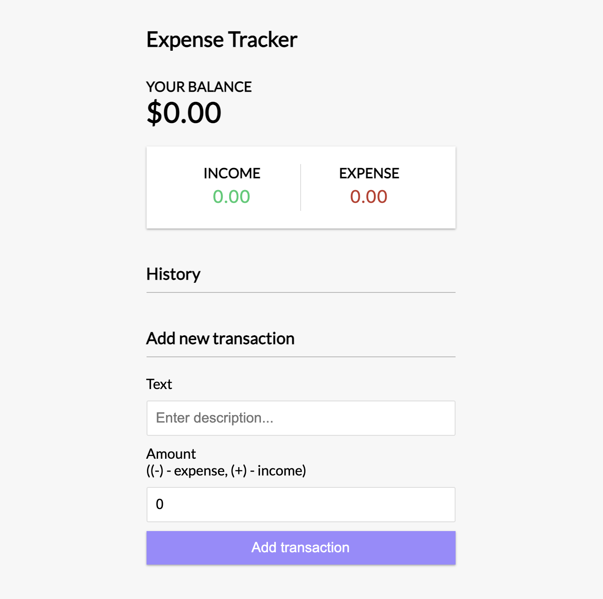
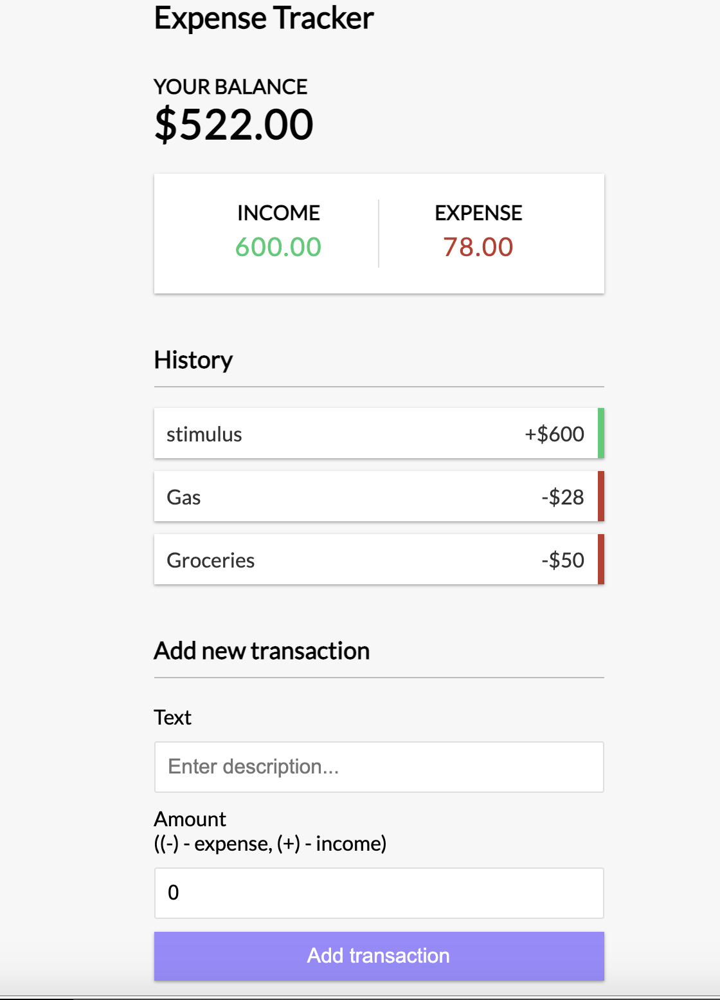

# Budget App - Expense Tracker
This is a simple income and expense app, where the user can enter the item and value. The Budget for the time period is shown, as well as sums of income and expense. The user can delete transactions from the history.

The initial front-end was built following a [tutorial](https://www.youtube.com/watch?v=XuFDcZABiDQ&feature=emb_logo) by TraversyMedia.

<p align="middle">
	
 
</p>
I plan on adding a Rails backend

## Technology Used
* ReactJS - for the front-end
* Context - Manage React State
<!-- * Rails - User Management
* PostgreSQL - Database
* Webpack - Applicaiton bundling -->

<!-- ### Demo available at: -->
Ensure that you have node installed on your machine:
Clone the app:
 <!-- Alternatively, you can clone this app -->
```
$ git clone https://github.com/laurieroy/react-expense-tracker
```

Build the app:
```
npm build
```
Run the app:
```
npm start
```
<!-- Install the gems
```
$ bundle install
``` -->
<!-- Create databases: 
```
$ rails db:create
```
(builds a development and testing database)

Run migrations:
```
$ rails db:migrate
```
Seed database with initial user: (optional). It runs the code found in `~/rails_react_recipe/db/seeds.rb`.
```
$ rails db:seed
```
## Run
To run your server locally
```
$ rails s
``` -->


To shut down the server use `Ctrl-C`

<!-- see what i have for the recipe one -->

This project was bootstrapped with [Create React App](https://github.com/facebook/create-react-app).
<!-- 
## Available Scripts

In the project directory, you can run:

### `yarn start` -->

Runs the app in the development mode.\
Open [http://localhost:3000](http://localhost:3000) to view it in the browser.

The page will reload if you make edits.\
You will also see any lint errors in the console.
<!-- 
### `yarn test`

Launches the test runner in the interactive watch mode.\
See the section about [running tests](https://facebook.github.io/create-react-app/docs/running-tests) for more information. -->
<!-- 
### `yarn build`

Builds the app for production to the `build` folder.\
It correctly bundles React in production mode and optimizes the build for the best performance.

The build is minified and the filenames include the hashes.\
Your app is ready to be deployed!

See the section about [deployment](https://facebook.github.io/create-react-app/docs/deployment) for more information.

### `yarn eject`

**Note: this is a one-way operation. Once you `eject`, you can’t go back!**

If you aren’t satisfied with the build tool and configuration choices, you can `eject` at any time. This command will remove the single build dependency from your project.

Instead, it will copy all the configuration files and the transitive dependencies (webpack, Babel, ESLint, etc) right into your project so you have full control over them. All of the commands except `eject` will still work, but they will point to the copied scripts so you can tweak them. At this point you’re on your own.

You don’t have to ever use `eject`. The curated feature set is suitable for small and middle deployments, and you shouldn’t feel obligated to use this feature. However we understand that this tool wouldn’t be useful if you couldn’t customize it when you are ready for it.

## Learn More

You can learn more in the [Create React App documentation](https://facebook.github.io/create-react-app/docs/getting-started).

To learn React, check out the [React documentation](https://reactjs.org/). -->


